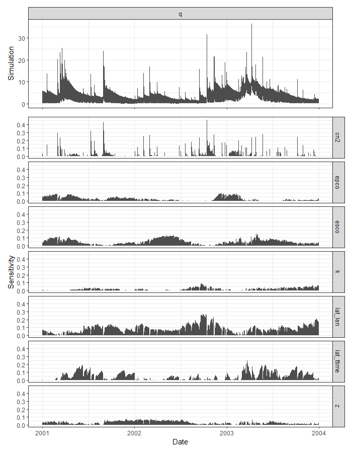

# temPAWN

`temPAWN` calculates the PAWN sensitivity index for each time step of simulation results that were generated with the `run_swat*()` functions from the `SWATplusR` package. The PAWN method is implemented according to Pianosi and Wagener (2018). `temPAWN` optionally includes the computation of the temporal sensitivity of a dummy parameter. Additionally, `temPAWN` offers a plot function to visualize the sensitivity analysis results.

## Installation

You can install the current version of `temPAWN` from the default branch of the package's GitHub repository:

```r
# If you do not have the package devtools installed
install.packages("devtools")

devtools::install_github("chrisschuerz/temPAWN")
```

## Minimum example

Although "minimum", the example requires quite some computation time. For demonstration, the demo SWAT+ model available from the `SWATdata` package will be used. In case you do not have `SWATplusR` and `SWATdata` installed yet on your computer, you can install both packages via:

```r
devtools::install_github("chrisschuerz/SWATplusR")

devtools::install_github("chrisschuerz/SWATdata")
```

### Run SWAT+ simulations

For the demo we run 1000 SWAT+ simulations to simulate discharge at the demo catchment outlet and y varing 7 model parameters. For further guidance to run SWAT+ simulations in R please see the `SWATplusR` [github page](https://chrisschuerz.github.io/SWATplusR/). To generate the 1000 parameter combinations and to run the simulations execute the following lines:

```r
library(SWATplusR)
library(tibble)
library(purrr)
library(lhs)

pth <- load_demo("pro", "set/the/path/where/to/write/the/demo", "plus")

par_bound <- tibble("cn2.hru | change = abschg" = c(-15, 10),
                    "lat_ttime.hru | change = absval" = c(0.5, 50),
                    "lat_len.hru | change = absval" = c(10, 100),
                    "k.sol | change = pctchg" = c(-50, 50),
                    "z.sol | change = pctchg" = c(-50, 50),
                    "esco.hru | change = absval" = c(0, 1),
                    "epco.hru | change = absval" = c(0, 1))

n_sample <- 1000
n_par <- ncol(par_bound)

par_pwn <- randomLHS(n = n_sample, k = n_par) %>%
  as_tibble(., .name_repair = "minimal") %>%
  map2_df(., par_bound, ~ (.x * (.y[2] - .y[1]) + .y[1])) %>%
  set_names(names(par_bound))


sim_pwn  <- run_swatplus(project_path = pth,
                       output = list(q = define_output(file = "channel",
                                                       variable = "flo_out",
                                                       unit = 1)),
                       parameter = par_pwn,
                       start_date = "2000-01-01",
                       end_date = "2003-12-31",
                       years_skip = 1,
                       n_thread = 4)
```

### Analysis with `tempPAWN`

To analyze the performed simulations use the function `tempawn()`. As the `sim` argument enter the data object that was returned by `run_swatplus()`. `tempawn()` provides additional input arguments for analysis settings. The two most relevant ones are `stat` and the `bins` arguments. To understand the effect of these arguments I want to refer to the publication of the PAWN method as it was proposed by Pianosi and Wagener ([2018](https://doi.org/10.1016/j.envsoft.2018.07.019)). The analysis is performed as follows:

```r
pwn <- tempawn(sim = sim_pwn)
```

### Visualization of the results

Plotting the `temPAWN` results works with the function `plot()`. The result is a visualization of the simulated ranges of the SWAT output variable and the corresponding parameter sensitivities.

```r
plot(pwn)
```



 
